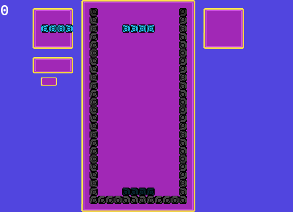

# Tetris made with SFML
## SFML Simple Fast Multimedia Library:


**Simple Fast Multimedia Library** - **[SFML](https://www.sfml-dev.org/index.php "SFML Website")**
G++ Compiler version (x86_64-posix-seh-rev0, Built by MinGW-W64 project) 8.1.0

## Start up
First go to the `MakeFile` and change the `SFML_DIR` to your **SFML** directory place
then:
```console
$ make all
$ cd build
$ ./tetris.exe
```


# OBS: The Project Still in Development

## GAME:



## Commands
**Arrows Keys**: to move around;
**C**: to hold the tetromino;
**Space**: to hard drop;
**R**: to rotate the tetromino.

## OBS2: The game loop isn't set right now for debugs purposes.
## OBS3: Game only tested on Windows.
